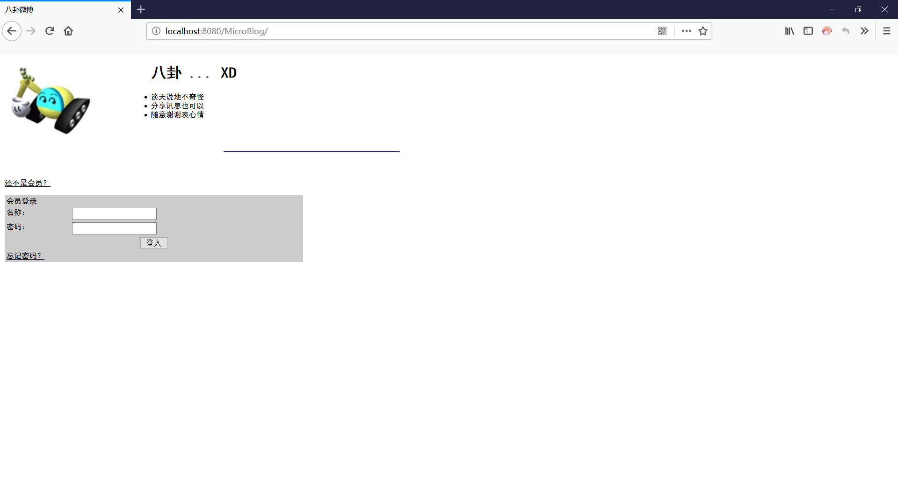

# 博客（MicroBlog）

## 简介：

**博客**是一款基于Servlet/JSP编写的后端应用软件，具备新用户注册、用户登录、发表博客等功能的。**博客**相关功能的实现参考书籍**《JSP&Servlet学习笔记（第二版）》**，代码遵循Apache v2 License开源协议。

## 屏幕截图

### 用户登录页面



### 用户注册页面


### 用户登录后发表博客页面


### 注销用户后展示最近博客


## 项目部署到Tomcat（版本：8.0.47）步骤如下：

### 1、下载**[博客服务器端应用软件，版本号：v1.0](https://gitee.com/lminediva/MicroBlog/releases/v1.0)**项目发行版war包。

### 2、将下载好的war包放到Tomcat安装目录下的webapps目录下。

### 3、修改Tomcat安装目录\conf\server.xml文件，找到<Host>标签，在其下添加内容，如下：

```xml
<Host name="localhost"  appBase="webapps"
            unpackWARs="true" autoDeploy="true">
			
		<!-- MicroBlog -->
		<Context path="/MicroBlog"
				 docBase="E:\tomcat\tomcat8\webapps\MicroBlog.war" 
				 reloadable="true">
				 <Resource name="jdbc/gossip"
				  auth="Container" type="javax.sql.DataSource"
				  maxActive="100" maxIdle="30" maxWait="10000" username="root"
				  password="你自己的MySQL数据库密码" driverClassName="com.mysql.cj.jdbc.Driver"
				  url="jdbc:mysql://localhost:3306/gossip?
useUnicode=true&amp;characterEncoding=UTF-8"/>
		<Realm className="org.apache.catalina.realm.DataSourceRealm"
				   localDataSource="true"
				   dataSourceName="jdbc/gossip"
				   userTable="t_account" userNameCol="name" userCredCol="password"
				   userRoleTable="t_account_role" roleNameCol="role"/>
		</Context>

        <!-- SingleSignOn valve, share authentication between web applications
             Documentation at: /docs/config/valve.html -->
        <!--
        <Valve className="org.apache.catalina.authenticator.SingleSignOn" />
        -->

        <!-- Access log processes all example.
             Documentation at: /docs/config/valve.html
             Note: The pattern used is equivalent to using pattern="common" -->
        <Valve className="org.apache.catalina.valves.AccessLogValve" directory="logs"
               prefix="localhost_access_log" suffix=".txt"
               pattern="%h %l %u %t &quot;%r&quot; %s %b" />

      </Host>
```

### 4、启动tomcat软件，访问http://localhost:8080/MicroBlog即可。

## 许可

> Copyright (C) liuhaiyang, Ganzhou Quxiang Inc. Open source codes for study only. Do not use for commercial purpose.
>
> Licensed under the Apache License, Version 2.0 (the "License"); you may not use this file except in compliance with the License. You may obtain a copy of the License at
>
> [http://www.apache.org/licenses/LICENSE-2.0](https://gitee.com/link?target=http%3A%2F%2Fwww.apache.org%2Flicenses%2FLICENSE-2.0)
>
> Unless required by applicable law or agreed to in writing, software distributed under the License is distributed on an "AS IS" BASIS, WITHOUT WARRANTIES OR CONDITIONS OF ANY KIND, either express or implied. See the License for the specific language governing permissions and limitations under the License.

